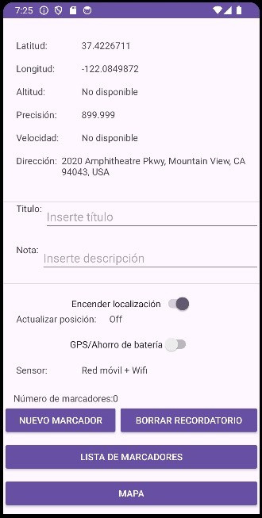
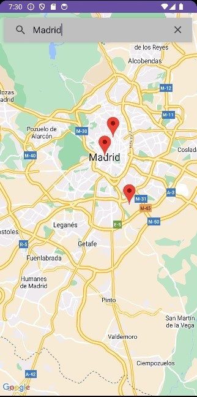
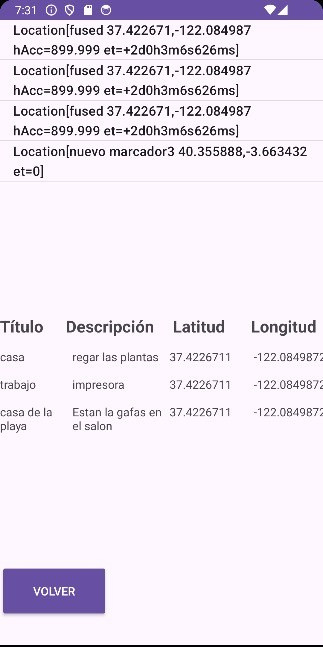

# MapMinder — Android GPS reminders

An Android app to save **geolocated reminders**: capture your current GPS position, attach a title and a note, and review your saved markers both as a list and on a Google Map.

Project developed for the **Android / Mobile Applications** course (4th year, Bachelor's in Industrial Technology Engineering — ETSII, UPM).

## Screenshots

| Main screen (GPS + new marker) | Map with markers | Saved markers list |
|:---:|:---:|:---:|
|  |  |  |

---

## Features

- **Live location data** — latitude, longitude, altitude, accuracy, speed and reverse-geocoded street address, using the Fused Location Provider.
- **Create markers** — save the current position with a title and a note.
- **Markers list** — browse every saved reminder in a dedicated screen.
- **Map view** — see the markers on an interactive **Google Map**.
- **Local persistence** — reminders stored in a **SQLite** database.
- **Splash screen** on launch and a portrait-locked UI.

---

## Architecture

| Component | Responsibility |
|---|---|
| `Pantallazo` | Splash screen shown for 3 s, then launches the main screen |
| `MainActivity` | Reads GPS data, shows live location, creates markers |
| `MapsActivity` | Displays the markers on a Google Map (`SupportMapFragment`) |
| `PantallaListaMarcadores` | Lists the saved markers |
| `SQLiteBaseDatos` | `SQLiteOpenHelper` — defines and manages the local database |
| `MyApplication` | Application singleton holding the in-memory list of markers |

**Stack:** Java · Android SDK (min 29 / target 33) · Google Play Services (Maps + Location) · SQLite · View Binding · Gradle.

---

## Build & run

1. Open the project in **Android Studio**.
2. Get a **Google Maps API key** with the *Maps SDK for Android* enabled — see the [official guide](https://developers.google.com/maps/documentation/android-sdk/get-api-key).
3. Create a `secrets.properties` file in the project root (it is git-ignored) with your key:
   ```properties
   MAPS_API_KEY=YOUR_REAL_KEY_HERE
   ```
   The [secrets-gradle-plugin](https://github.com/google/secrets-gradle-plugin) injects it into the manifest as `${MAPS_API_KEY}`. Without it, the build falls back to the placeholder in `local.defaults.properties` and the map will not load.
4. Run on a device/emulator with Google Play Services and grant location permission.

> **Note:** no API key is committed to this repository — each developer supplies their own via `secrets.properties`.

---

## Repository structure

```
mapminder-android/
├── app/
│   └── src/main/
│       ├── java/com/example/gpsdemo/   Activities, DB helper and Application
│       ├── res/                        Layouts, drawables, values, icons
│       └── AndroidManifest.xml
├── local.defaults.properties           Placeholder for MAPS_API_KEY (real key goes in secrets.properties)
├── build.gradle / settings.gradle      Gradle configuration
└── docs/
    ├── memoria.pdf                      Technical report (Spanish)
    └── presentacion.pdf                 Visual walkthrough with screenshots (Spanish)
```

---

## Authors

Team project (Group A1) — Android Programming course, Bachelor's in Industrial Technology Engineering, ETSII (UPM).

Pablo Lecocq · Andrea Barros · Rodrigo Díaz.
